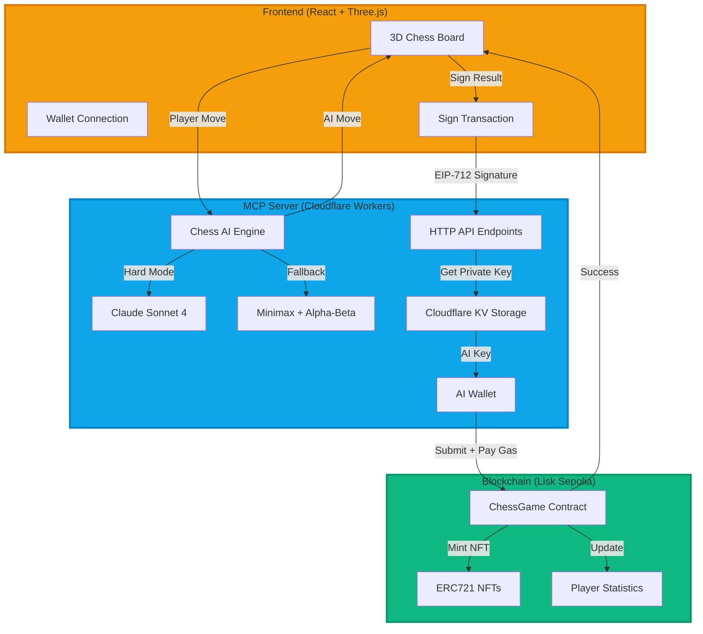

# NullShot Chess -> AI-Powered Decentralized Chess Platform

## Project Overview

**NullShot Chess** is a full stack decentralized chess application that combines cutting edge AI, blockchain technology, and immersive 3D gameplay. Built with the NullShot MCP framework, this project demonstrates the power of Model Context Protocol (MCP) agents in creating intelligent, autonomous systems.

### What Makes This Unique?

1. **Gasless Blockchain Submission**: AI wallet pays transaction fees, enabling free gameplay for users
2. **Intelligent Chess AI**: Powered by Claude Sonnet 4 + Minimax algorithm with position evaluation
3. **Autonomous Agent**: MCP server handles both chess moves AND blockchain submissions
4. **EIP-712 Security**: Cryptographic signatures verify game results without trust
5. **NFT Rewards**: ERC721 badges minted automatically for victories

The project integrates **three core components**:

- **MCP Server** (Cloudflare Workers): AI chess engine + blockchain orchestration
- **Smart Contract** (Lisk Sepolia): Game verification, statistics, NFT minting
- **React Frontend** (3D Interface): Immersive gameplay with 10 themes & boards

---

## Architecture



### Component Flow

#### 1. Chess Move Generation

```
Player Move → MCP Server → Cache Check → Opening Book? → Claude AI? → Minimax Fallback → Legal Move Validation → Return Move
```

#### 2. Blockchain Submission (Gasless)

```
Game Ends → Human Signs EIP-712 Message → MCP Server Receives Signature →
AI Wallet Retrieves Key from KV → AI Wallet Submits Transaction →
Smart Contract Verifies Signature → Mints NFT to Winner → Returns Tx Hash
```

---

## MCP Create (AI Agent Server)

The MCP server is implemented using the `my-chess-agent/mcp-server` repository. It is based on the NullShot Typescript MCP Template designed to bootstrap MCPs (Model Context Protocols) using the null-shot/typescript-agent-framework.

### Key Features:

- Real time communication through WebSocket and Server Sent Events (SSE) clients.
- MCP Inspector for debugging and monitoring during development.
- Cloudflare Workers integration for edge deployment.
- Comprehensive testing tools enabling local integration tests without mocking.
- Extensible server logic allowing custom routes, tools, resources, and prompts.

### Usage Overview:

- Setup via NullShot CLI, Cloudflare deployment, or GitHub template.
- Server implementation leverages `McpHonoServerDO` for clean routing, or `McpServerDO` for custom routing.
- Core functionalities are modularized in TypeScript files enabling extensions or customizations.
- The MCP server powers the backend AI moves and orchestrates real time interactions with connected clients.

---

## Smart Contract (ChessGame.sol)

The smart contract is deployed on the Lisk Sepolia testnet, residing in `smartcontract/nullshotChess/src/ChessGame.sol`. It is a Solidity contract extending ERC721 and using OpenZeppelin libraries to ensure security and functionality.

### Main Features:

- **Game Tracking**: Manages game records for player vs. player and player vs. AI matches, storing results and timestamps.
- **EIP-712 Signature Verification**: Securely verifies game results submitted by players to prevent tampering.
- **NFT Rewards**: Mints ERC721 tokens called "ChessVictory" to winning players as collectible badges.
- **Statistics Tracking**: Maintains counts of wins, losses, draws, and total games played for each player.
- **Events**: Emits events for game submissions and NFT minting facilitating easy off-chain monitoring and leaderboard updates.

Key functions include:

- `submitTwoPlayerGame`: Validates and submits results for human player matches.
- `submitAIGame`: Handles AI games and rewards accordingly.
- Internal logic to record games, update stats, and mint NFTs securely.

---

## Frontend (nullshotchess-frontend)

The frontend is a React and TypeScript-powered decentralized application that brings the chess experience to life with immersive 3D graphics and smooth interactions.

### Features:

- **3D Chess Gameplay**: Built with React Three Fiber and Three.js for realistic rendering of chess pieces and boards.
- **Game Modes**: Play against another player locally or against the NullShot AI powered by the MCP server.
- **Theme and Board Customization**: 10 luxurious themes and 10 different board designs to personalize the game.
- **Blockchain Integration**: Submits game results with EIP-712 typed signatures to the smart contract, enabling NFT minting on wins.

---

## Innovation Highlights

### 1. Gasless UX (Zero-Fee Gameplay)

**Problem**: Blockchain games require users to hold native tokens for gas fees, creating friction.

**Solution**: The MCP server maintains an AI wallet that pays gas fees on behalf of users.

**How It Works**:

1. Human signs an EIP-712 message proving they approve the game result
2. AI wallet retrieves its private key from Cloudflare KV (secure storage)
3. AI wallet submits the transaction, paying the gas fee
4. Smart contract verifies the human's signature before executing
5. If AI wallet runs out of gas, frontend falls back to manual submission

**Impact**: Users can play chess, win NFTs, and get on-chain stats WITHOUT owning any ETH.

### 2. Multi-Tier AI Chess Engine

**Adaptive Difficulty**:

- **Easy**: Minimax depth 2, high randomness (±100 points)
- **Medium**: Minimax depth 3, moderate randomness (±50 points)
- **Hard**: Minimax depth 4 + Claude Sonnet 4, minimal randomness (±20 points)

**Opening Book**: First 3 moves use pre-programmed openings (e4, d4, Nf3, c4) for strong starts

**Claude Integration**:

- Prompts Claude as "2800+ ELO chess engine"
- Provides FEN position + legal moves + game phase
- 8-second timeout with automatic fallback
- Validates AI response against legal moves

**Fallback Algorithm**:

- Minimax with alpha-beta pruning
- Move ordering (captures > checks > center control)
- Positional evaluation with material + mobility
- Detects checkmate/stalemate

### 3. EIP-712 Cryptographic Verification

Uses Ethereum's typed data signing standard:

```solidity
struct GameResult {
    string gameId;
    address humanPlayer;
    bool humanWon;
    bool isDraw;
}
```

**Security Benefits**:

- Tamper-proof results (signature proves human authorized)
- No central authority needed
- Signatures can't be replayed (nonce included)
- Works with any wallet (MetaMask, WalletConnect, etc.)

### 4. Edge-Deployed MCP Server

**Cloudflare Workers Advantages**:

- Global edge deployment (low latency worldwide)
- Durable Objects for session persistence
- KV storage for AI wallet security
- Automatic scaling (handles traffic spikes)
- WebSocket/SSE support for real-time moves

---

## Deployment

### MCP Server (Cloudflare Workers)

```bash
cd my-chess-agent/mcp-server

# Install dependencies
npm install

# Login to Cloudflare
npx wrangler login

# Deploy
npx wrangler deploy

# Set environment variables
npx wrangler kv:key put --binding=KV_NULLSHOTCHESS "AI_WALLET_KEY" "<YOUR_PRIVATE_KEY>"
```

**Required Environment Variables**:

- `ANTHROPIC_API_KEY`: Claude API key (for hard mode)
- `KV_NULLSHOTCHESS`: Cloudflare KV namespace for AI wallet
- `AI_WALLET_KEY`: Private key stored in KV

### Smart Contract (Lisk Sepolia)

```bash
cd smartcontract/nullshotChess

# Install Foundry
curl -L https://foundry.paradigm.xyz | bash
foundryup

# Compile
forge build

# Deploy
forge create --rpc-url https://rpc.sepolia-api.lisk.com \
  --private-key <YOUR_KEY> \
  src/ChessGame.sol:ChessGame

# Verify on Blockscout
forge verify-contract <CONTRACT_ADDRESS> \
  src/ChessGame.sol:ChessGame \
  --chain-id 4202 \
  --verifier blockscout \
  --verifier-url https://sepolia-blockscout.lisk.com/api
```

**Contract Address**: `0x9B7CeF0B7cFf1a46D2cEC347DCAD63C3c721a183`

### Frontend (React)

```bash
cd nullshotchess-frontend

# Install dependencies
npm install

# Run development server
npm run dev

# Build for production
npm build

# Deploy to Vercel
vercel deploy --prod
```

**Environment Variables** (.env):

```
VITE_THIRDWEB_CLIENT_ID=your_client_id
VITE_CONTRACT_ADDRESS=0x9B7CeF0B7cFf1a46D2cEC347DCAD63C3c721a183
VITE_MCP_SERVER_URL=https://your-worker.workers.dev
```

## Documentation

- **[MCP Server README](my-chess-agent/mcp-server/README.md)**: Detailed MCP server documentation
- **[Frontend README](nullshotchess-frontend/README.md)**: React app setup and architecture
- **[Nullshot Publishing Guide](my-chess-agent/mcp-server/NULLSHOT_PUBLISHING.md)**: How to publish on Nullshot
- **[Smart Contract Source](smartcontract/nullshotChess/src/ChessGame.sol)**: Solidity contract code

---

## Contributing

Contributions welcome! This is an open source project built for the community.

1. Fork the repository
2. Create feature branch (`git checkout -b feature/amazing-feature`)
3. Commit changes (`git commit -m 'Add amazing feature'`)
4. Push to branch (`git push origin feature/amazing-feature`)
5. Open Pull Request

---

## License

MIT License - See [LICENSE](LICENSE) for details.

---

## Contact

**Developer**

- Email: georgechipaul@gmail.com

---

**Built with MCP**
**Made with ♔ for Chess Enthusiasts & Blockchain Innovators**
